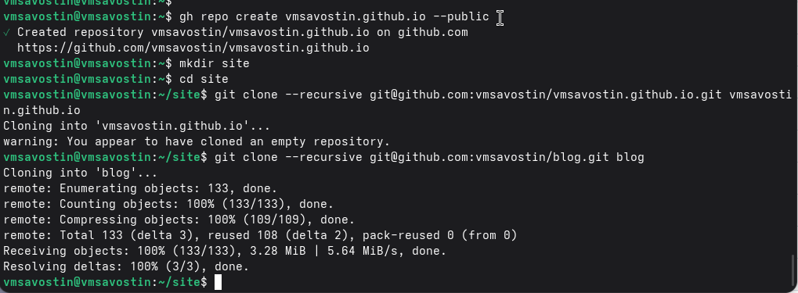

---
## Author
author:
  name: Савостин Владислав Михайлович
  email: 1132250405@rudn.ru
  affiliation:
    - name: Российский университет дружбы народов
      country: Российская Федерация
      postal-code: 117198
      city: Москва
      address: ул. Миклухо-Маклая, д. 6
	  
## Title
title: Операционные системы
subtitle: Отчёт по 1 этапу проекта
license: CC BY
date: today
date-format: "YYYY-MM-DD" # Example: 2025-09-06
---

# Цели и задачи

## Цель лабораторной работы

Подготовить репозиторий на основе шаблона. 

Ознакомиться с генератором сайтов hugo.

# Выполнение лабораторной работы

## Создание репозитория из шаблона

{ #fig:001 width=70% height=70%}

## Создание локальных репозиториев

{ #fig:002 width=70% height=70%}

## Инициализация hugo

{ #fig:003 width=70% height=70%}

## Подготовка репозитория

{ #fig:004 width=70% height=70%}

## Подготовка папки public

{ #fig:005 width=70% height=70%}

## Развертывание сайта

{ #fig:006 width=70% height=70%}

# Выводы

## Результаты выполнения лабораторной работы

Подготовили репозиторий и установили hugo.