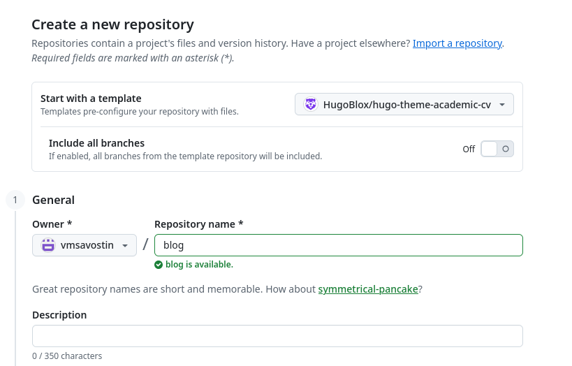
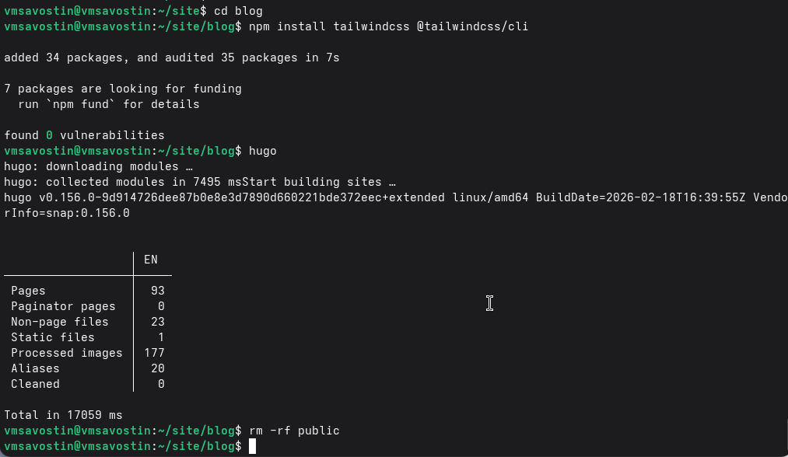
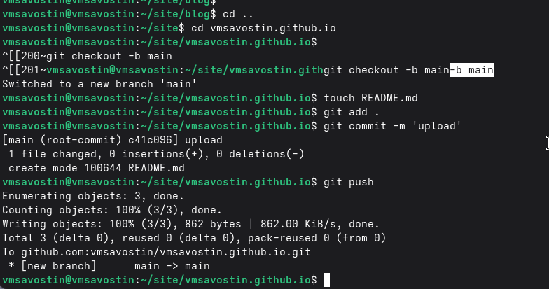
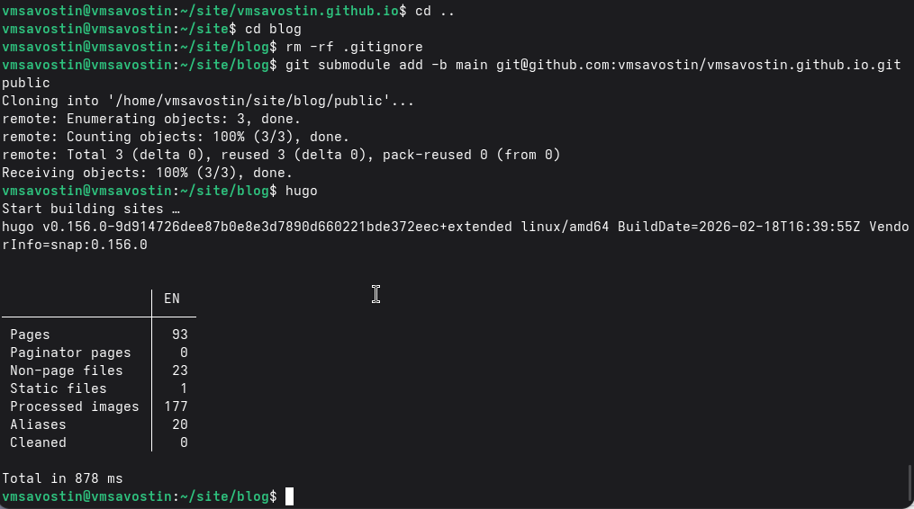
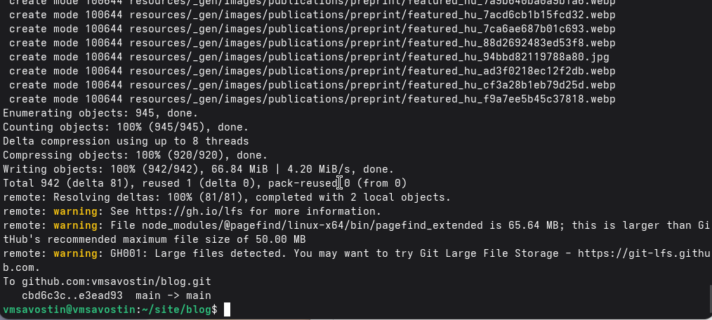

---
## Author
author:
  name: Савостин Владислав Михайлович
  email: 1132250405@rudn.ru
  affiliation:
    - name: Российский университет дружбы народов
      country: Российская Федерация
      postal-code: 117198
      city: Москва
      address: ул. Миклухо-Маклая, д. 6

## Title
title: "Отчёт по 1 этапу проекта"
subtitle: "Сайт научного работника"
license: "CC BY"
---

# Цель работы

Подготовить репозиторий на основе шаблона. Ознакомиться с генератором сайтов hugo.

# Выполнение работы

Клонирую репозиторий с шаблоном сайта-визитки.

{ #fig:001 width=70% height=70%}

Создаю локальные репозитории для размещение сайта.

{ #fig:002 width=70% height=70%}

Тестирую запуск hugo.

{ #fig:003 width=70% height=70%}

Подготовка репозитория для файлов сайта.

{ #fig:004 width=70% height=70%}

Связывание папки public с подготовленным репозиторием.

{ #fig:005 width=70% height=70%}

Развертывание сайта на основе HitHub Pages.

{ #fig:006 width=70% height=70%}

# Выводы

Подготовили репозиторий и установили hugo.