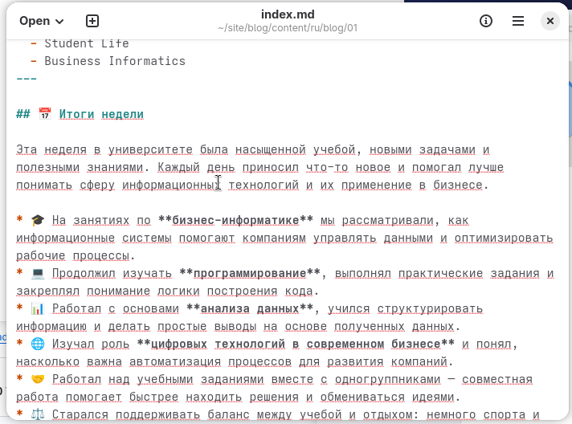

---
## Author
author:
  name: Савостин Владислав Михайлович
  email: 1132250405@rudn.ru
  affiliation:
    - name: Российский университет дружбы народов
      country: Российская Федерация
      postal-code: 117198
      city: Москва
      address: ул. Миклухо-Маклая, д. 6
	  
## Title
title: Операционные системы
subtitle: Отчёт по 2 этапу проекта
license: CC BY
date: today
date-format: "YYYY-MM-DD" # Example: 2025-09-06
---

# Цели и задачи

## Цель лабораторной работы

Добавить к сайту данные о себе.

# Выполнение лабораторной работы

## Файл об авторе

{ #fig:001 width=70% height=70%}

## Файл для поста

{ #fig:002 width=70% height=70%}

## Файл для публикации

{ #fig:003 width=70% height=70%}

# Выводы

## Результаты выполнения лабораторной работы

Добавили к сайту данные о себе.